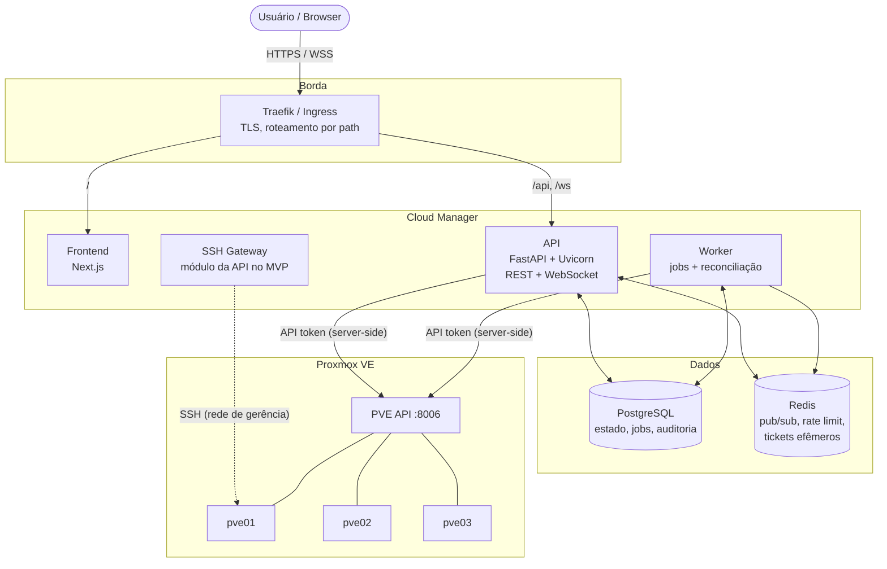
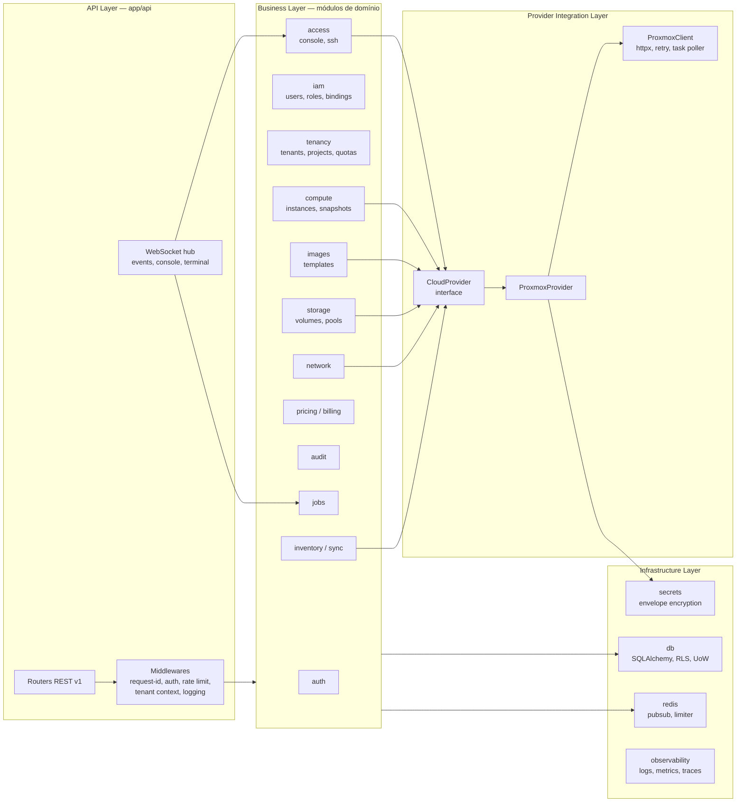
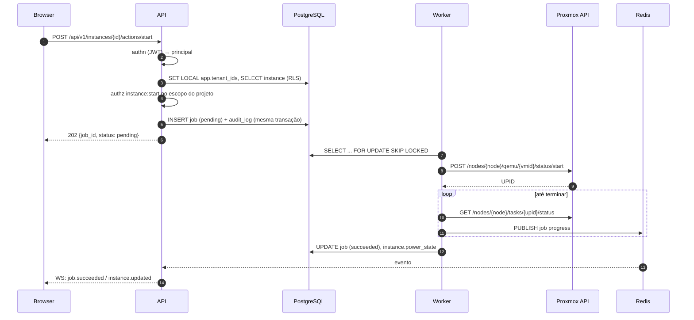
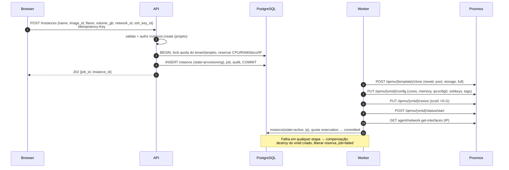

# 01 — Visão geral da arquitetura

## Objetivo

O Cloud Manager é uma **camada de cloud management multi-tenant sobre o Proxmox VE**.
O Proxmox continua sendo o hypervisor e a fonte de verdade do estado de execução; a
plataforma adiciona o que o Proxmox não resolve para self-service: tenants, projetos,
RBAC por escopo, quotas, preço, catálogo de imagens, auditoria, console/SSH mediados e
uma API estável que não vaza conceitos do PVE.

O usuário enxerga `Instance`, `Image`, `Volume`, `Network`, `Project`, `Tenant`.
Ele **não** enxerga `qemu config`, `UPID`, `vmid`, `node` (o node aparece só para
administradores de plataforma).

## Princípios

1. **Monólito modular + worker** — um único backend FastAPI com módulos de domínio bem
   separados e um processo worker que executa jobs longos. Sem microsserviços no MVP
   ([ADR-0001](../adr/0001-monolito-modular.md)).
2. **Provider abstraction desde o dia 1** — o domínio fala com `CloudProvider`; o
   `ProxmoxProvider` é a única implementação inicial ([ADR-0002](../adr/0002-provider-abstraction.md)).
3. **Proxmox é a fonte de verdade do runtime; o banco é a fonte de verdade de posse,
   intenção e política** ([ADR-0003](../adr/0003-fonte-de-verdade-e-sincronizacao.md)).
4. **Isolamento de tenant em duas camadas** — escopo obrigatório na aplicação +
   Row-Level Security no PostgreSQL ([ADR-0004](../adr/0004-isolamento-de-tenant.md)).
5. **Tudo que demora vira job** — HTTP responde `202 Accepted` com `job_id`; o worker
   executa e publica progresso ([ADR-0006](../adr/0006-jobs-em-postgres.md)).
6. **O browser nunca fala com o Proxmox** — nem API, nem WebSocket de console. O backend
   é proxy autenticado ([ADR-0008](../adr/0008-console-proxy.md)).
7. **Credenciais nunca em texto puro** — token do PVE cifrado em repouso (envelope
   encryption), SSH com certificados efêmeros ([ADR-0007](../adr/0007-credenciais-proxmox.md),
   [ADR-0009](../adr/0009-ssh-certificados-efemeros.md)).

## Topologia de deploy (MVP)

Frontend e API ficam **na mesma origem** (`https://cloud.exemplo.com/` e
`https://cloud.exemplo.com/api`). Isso elimina CORS na operação normal e permite
cookie `SameSite=Strict` para o refresh token ([ADR-0005](../adr/0005-autenticacao.md)).

## Diagrama de componentes (backend)

Regra de dependência (verificada por `import-linter` a partir da Fase 1):

- `api` → `domain` → (`infra`, `providers.base`)
- `providers.proxmox` → `providers.base`, `infra.secrets`
- **Nenhum módulo de domínio importa `providers.proxmox`**. O provider é resolvido por
  cluster em runtime através de um registry.

## Fluxos principais

### Ação síncrona curta: `start` de uma instância

`start` no PVE já é uma task assíncrona (devolve `UPID`), então até ações "simples"
viram job. A diferença é que são jobs curtos e a UI mostra progresso inline.

### Criação de instância a partir de imagem

### Console web

Ver [07 — Tempo real, console e SSH](07-realtime-console-ssh.md).

## Requisitos não-funcionais e como são atendidos

| Requisito | Como |
|---|---|
| Isolamento entre tenants | Escopo obrigatório no repositório + RLS no PostgreSQL + IDs opacos (UUID) + 404 para recurso de outro tenant + suíte de testes cross-tenant |
| Proxmox indisponível não derruba a UI | Leituras servem do inventário em banco (com `last_synced_at`), circuit breaker por cluster, erros em `application/problem+json` com `request_id` |
| Operações longas não bloqueiam HTTP | Jobs em PostgreSQL + worker, progresso por WebSocket |
| Auditabilidade | `audit_logs` append-only, gravado na mesma transação da intenção |
| Extensível para outros hypervisors | `CloudProvider` + registry; modelo de domínio sem campos do PVE (exceto `provider_ref` JSONB) |
| Escala horizontal | API stateless; WebSocket fan-out via Redis pub/sub; worker com `SKIP LOCKED` permite N réplicas |
| Observabilidade | Logs JSON com `request_id`/`tenant_id`, `/metrics` Prometheus, OpenTelemetry opcional |
