# 02 — Domínio e modelo de dados

## Entidades principais

| Entidade (domínio) | Tabela | Descrição |
|---|---|---|
| User | `users` | Pessoa que se autentica. Global (não pertence a um tenant). |
| Identity | `user_identities` | Vínculo com IdP (`local`, `oidc:keycloak`, `oidc:entra`…). Prepara SSO sem mudar `users`. |
| Tenant | `tenants` | Unidade de isolamento, cobrança e quota. **É a "Organization"** ([ADR-0004](../adr/0004-isolamento-de-tenant.md)). |
| Membership | `tenant_memberships` | Usuário ∈ tenant. Um usuário pode estar em vários tenants. |
| Project | `projects` | Agrupador de recursos dentro do tenant. Toda instância pertence a exatamente um projeto. |
| Role / Permission | `roles`, `permissions`, `role_permissions` | Catálogo RBAC. Roles de sistema são seed; roles customizadas por tenant ficam para depois. |
| RoleBinding | `role_bindings` | `(user, role, scope)` onde scope ∈ {platform, tenant, project}. |
| ProviderCluster | `provider_clusters` | Um cluster Proxmox (ou futuro VMware/OpenStack). |
| ProviderCredential | `provider_credentials` | Token do PVE cifrado (envelope encryption). Nunca sai do backend. |
| Node | `nodes` | Node do cluster (inventário). Só visível para admins de plataforma. |
| Instance | `instances` | VM **ou** container (`kind = vm | container`). |
| Volume | `volumes` | Disco de uma instância (ou solto, no futuro). |
| Snapshot | `snapshots` | Snapshot de instância. |
| Image | `images` | Template/catálogo. Visibilidade `public | tenant | private`. |
| StoragePool | `storage_pools` | Storage do PVE (`local-lvm`, `ceph-rbd`…) + quais são oferecidos a tenants. |
| Network | `networks` | Rede do tenant (MVP: mapeia para bridge/VLAN; Fase 2: SDN VNet). |
| IpAllocation | `ip_allocations` | IPAM simples da plataforma. |
| Quota | `quotas` | Limites por tenant (e opcionalmente por projeto). |
| QuotaReservation | — | Na implementação (Fase 2a) a própria linha da instância em `provisioning` é a reserva: criada na mesma transação, sob advisory lock por tenant; falha definitiva a retira do uso. Tabela separada só se surgirem recursos reservados sem instância. |
| PriceTable / PriceItem | `price_tables`, `price_items` | Tabela de preço versionada (itens com `effective_from`); uma é a padrão; tenant pode ter tabela própria (`tenants.price_table_id`). [ADR-0015](../adr/0015-custos-e-precos.md) |
| UsageRecord | `usage_records` | Uma linha por instância por hora UTC: segundos, segundos ligada e custo por recurso, acumulados pelo worker. RLS: tenant lê, só plataforma escreve. |
| Job | `jobs`, `job_events` | Operações assíncronas e seu histórico. |
| AuditLog | `audit_logs` | Trilha append-only. |
| SshKey | `ssh_public_keys` | Chaves públicas do usuário (só públicas). |
| ConsoleSession / SshSession | `console_sessions`, `ssh_sessions` | Sessões de acesso, para auditoria e revogação. |
| RefreshToken | `refresh_tokens` | Refresh tokens rotativos (hash), família para detecção de reuso. |
| SyncRun / Drift | `sync_runs`, `inventory_drifts` | Execuções de reconciliação e divergências encontradas. |

### Por que `instances` única em vez de `virtual_machines` + `containers`

~80% dos campos são comuns (nome, projeto, CPU, RAM, estado, IP, tags, custo, quota).
Uma tabela com `kind` simplifica quota, preço, listagem unificada, RBAC e auditoria. O que
é específico (BIOS/machine type para VM; `unprivileged`/features para LXC) vai em
`spec JSONB` validado por schema Pydantic por `kind`. As permissões continuam separadas
(`vm:*` e `container:*`) porque o requisito de produto pede isso — o mapeamento é feito no
`authorize()` pelo `kind`.

### IDs internos × IDs do provider

- Toda entidade usa **UUIDv7** (ordenável por tempo, bom para índice B-tree).
- O que identifica o recurso no provider fica em `provider_ref JSONB`, ex.:
  `{"cluster_id": "…", "node": "pve02", "vmid": 105, "type": "qemu"}`.
- `vmid` e `node` **nunca** são aceitos do cliente. A API recebe `instance_id` (UUID),
  carrega a linha com RLS e só então o provider lê o `provider_ref`.
- Índice único `(cluster_id, (provider_ref->>'vmid'))` impede dois registros apontando
  para o mesmo guest.

## Diagrama ER (MVP + previsão das fases seguintes)

```mermaid
erDiagram
    users ||--o{ user_identities : has
    users ||--o{ tenant_memberships : "member of"
    tenants ||--o{ tenant_memberships : has
    tenants ||--o{ projects : owns
    users ||--o{ role_bindings : granted
    roles ||--o{ role_bindings : "used in"
    roles ||--o{ role_permissions : contains
    permissions ||--o{ role_permissions : "part of"
    users ||--o{ refresh_tokens : holds
    users ||--o{ ssh_public_keys : owns

    provider_clusters ||--|| provider_credentials : "authenticates with"
    provider_clusters ||--o{ nodes : contains
    provider_clusters ||--o{ storage_pools : exposes
    provider_clusters ||--o{ instances : hosts
    nodes ||--o{ instances : "runs on"

    tenants ||--o{ instances : owns
    projects ||--o{ instances : groups
    instances ||--o{ volumes : attaches
    instances ||--o{ snapshots : has
    instances ||--o{ ip_allocations : uses
    storage_pools ||--o{ volumes : "allocated in"
    images ||--o{ instances : "created from"
    tenants ||--o{ images : "owns (private)"
    tenants ||--o{ networks : owns
    networks ||--o{ ip_allocations : allocates

    tenants ||--o{ quotas : limited_by
    tenants ||--o{ quota_reservations : reserves
    price_tables ||--o{ price_items : has
    tenants }o--o| price_tables : "priced by"
    tenants ||--o{ usage_records : accrues

    tenants ||--o{ jobs : runs
    jobs ||--o{ job_events : logs
    users ||--o{ audit_logs : performs
    instances ||--o{ console_sessions : accessed_via
    instances ||--o{ ssh_sessions : accessed_via

    users {
        uuid id PK
        text email UK "normalizado em minúsculas (CHECK)"
        text display_name
        text password_hash "argon2id, null se só SSO"
        bool is_active
        timestamptz mfa_enrolled_at
        int failed_login_count
        timestamptz locked_until
        timestamptz created_at
    }
    tenants {
        uuid id PK
        text slug UK
        text name
        text status "active|suspended"
        uuid price_table_id FK
        timestamptz created_at
    }
    projects {
        uuid id PK
        uuid tenant_id FK
        text slug
        text name
        timestamptz deleted_at
    }
    role_bindings {
        uuid id PK
        uuid user_id FK
        uuid role_id FK
        text scope_type "platform|tenant|project"
        uuid scope_id "null para platform"
        uuid tenant_id "denormalizado p/ RLS"
    }
    provider_clusters {
        uuid id PK
        text provider "proxmox"
        text name
        text api_url
        text ca_pem "null = CAs do sistema"
        text status
        jsonb settings "vmid_range, pool_prefix"
        timestamptz last_synced_at
    }
    provider_credentials {
        uuid cluster_id PK
        text token_id "user@realm!tokenid"
        bytea secret_ciphertext
        bytea dek_wrapped
        text kek_ref
        timestamptz rotated_at
    }
    instances {
        uuid id PK
        uuid tenant_id FK
        uuid project_id FK
        uuid cluster_id FK
        uuid node_id FK
        text kind "vm|container"
        text name
        text state "provisioning|active|error|deleting|deleted"
        text power_state "running|stopped|paused|unknown"
        int vcpus
        int memory_mb
        int root_disk_gb
        uuid image_id FK
        jsonb provider_ref
        jsonb spec
        text_array tags
        bool managed "false = descoberta, não adotada"
        timestamptz last_seen_at
        int version "optimistic lock"
    }
    images {
        uuid id PK
        uuid tenant_id "null = pública"
        text visibility "public|tenant|private"
        text os_family
        text name
        int min_disk_gb
        jsonb provider_ref
    }
    quotas {
        uuid id PK
        uuid tenant_id FK
        uuid project_id "null = quota do tenant"
        text resource "vcpus|memory_mb|storage_gb|instances|containers|snapshots|ipv4"
        bigint limit_value
    }
    quota_reservations {
        uuid id PK
        uuid tenant_id FK
        uuid job_id FK
        text resource
        bigint amount
        text status "reserved|committed|released"
        timestamptz expires_at
    }
    jobs {
        uuid id PK
        uuid tenant_id FK
        uuid requested_by FK
        text type "instance.create, instance.start…"
        text status "pending|running|succeeded|failed|cancelled"
        uuid resource_id
        jsonb payload
        jsonb result
        text error_code
        int attempts
        text idempotency_key
        timestamptz run_after
        timestamptz locked_until
    }
    audit_logs {
        bigint id PK
        timestamptz occurred_at
        uuid actor_user_id
        uuid tenant_id
        text action "INSTANCE_CREATE…"
        text resource_type
        uuid resource_id
        text outcome "success|denied|failure"
        inet source_ip
        text request_id
        jsonb details
    }
```

Tabelas não detalhadas no diagrama (`volumes`, `snapshots`, `networks`,
`ip_allocations`, `storage_pools`, `nodes`, `price_*`, `usage_records`, `*_sessions`,
`refresh_tokens`, `sync_runs`, `inventory_drifts`) seguem o mesmo padrão: `id uuid`,
`tenant_id` quando são tenant-scoped, `provider_ref jsonb` quando espelham algo do PVE,
`created_at/updated_at`.

## Convenções de banco

- **Toda tabela tenant-scoped tem `tenant_id NOT NULL`** e policy RLS (ver
  [03](03-tenancy-e-rbac.md)). Tabelas globais (`users`, `roles`, `permissions`,
  `provider_clusters`, `nodes`, `storage_pools`, `price_tables`) não têm RLS, mas só são
  acessíveis via endpoints de plataforma ou por projeção filtrada.
- Soft delete (`deleted_at`) para `projects`, `instances`, `images`; hard delete para o
  resto. `audit_logs` nunca sofre `UPDATE/DELETE` (revogado no grant do role da app).
- `audit_logs` e `job_events` particionados por mês (`PARTITION BY RANGE (occurred_at)`)
  a partir da Fase 5.
- Optimistic locking (`version`) em `instances` para evitar sobrescrita concorrente
  entre reconciliador e ações do usuário.
- Migrations com Alembic; **migrations nunca usam o role da aplicação** (usam o role
  `cm_owner`), porque o role da app não é dono das tabelas (necessário para RLS valer).
- Valores monetários em `numeric(18,6)` + `currency char(3)`; nunca float.
