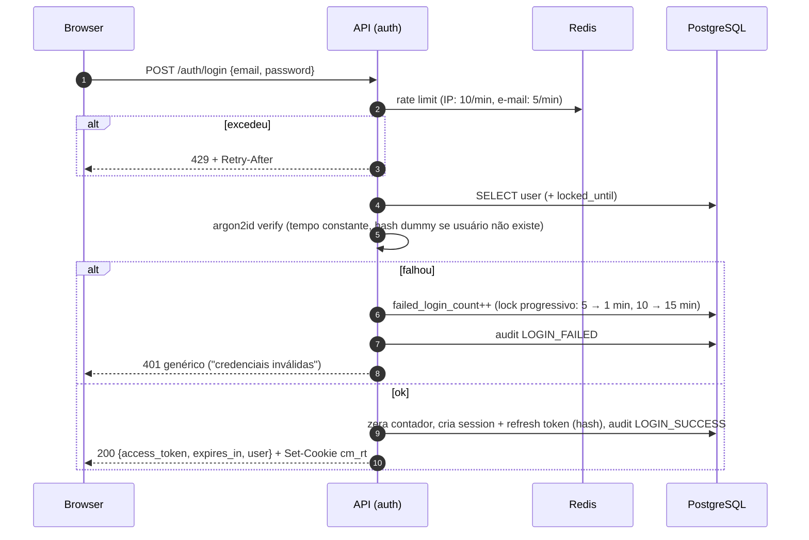
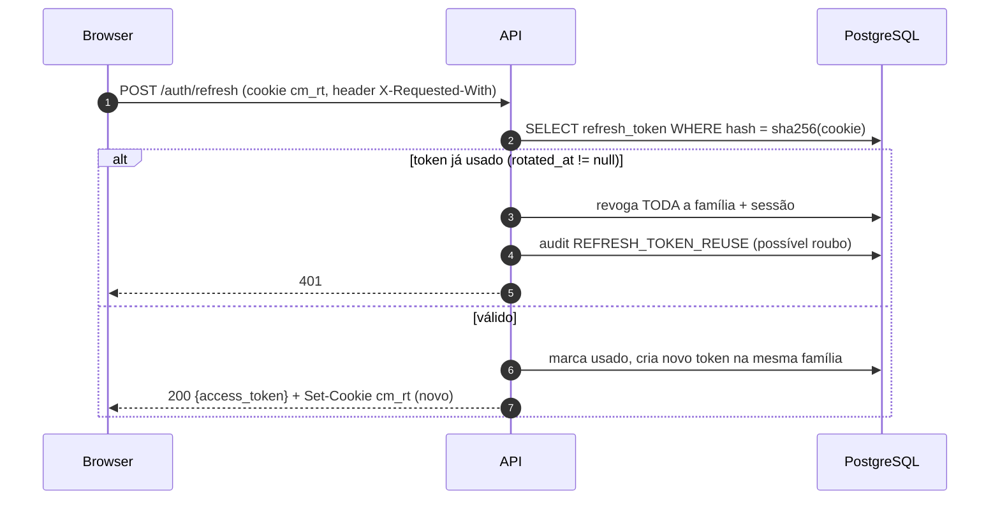
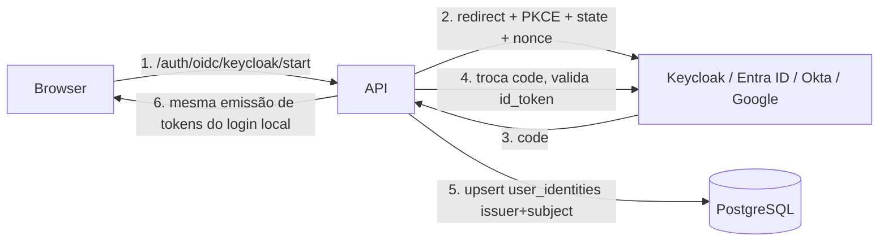

# 06 — Autenticação

Decisão em [ADR-0005](../adr/0005-autenticacao.md). Autenticação é um módulo isolado
(`app/auth`) que entrega ao resto do sistema apenas um `Principal`
(`user_id`, `session_id`, `amr`, `auth_time`). Nenhum módulo de domínio sabe se o usuário
entrou por senha ou por OIDC.

## Tokens

| Token | Formato | TTL | Onde fica no browser | Revogação |
|---|---|---|---|---|
| Access | JWT assinado **EdDSA (Ed25519)**, `kid` no header | 10 min | **memória** (variável JS), enviado em `Authorization: Bearer` | Expira rápido; `sid` checado contra lista de sessões revogadas no Redis |
| Refresh | Opaco, 256 bits, guardado como **hash SHA-256** em `refresh_tokens` | 12 h ociosa / 7 d absoluta | Cookie `cm_rt`: `HttpOnly; Secure; SameSite=Strict; Path=/api/v1/auth` | Rotação a cada uso; reuso → revoga a família inteira |
| Ticket de console/SSH | Opaco, uso único | 30 s | query string do WS | Consumido no upgrade (Redis `GETDEL`) |

Claims do access token: `iss`, `aud=cloud-manager-api`, `sub` (user_id), `sid`,
`iat`, `exp`, `jti`, `amr` (`["pwd"]`, `["pwd","otp"]`, `["oidc"]`). **Roles e tenants
não vão no token** — são resolvidos por request (cache Redis 30s, invalidado ao alterar
binding). Assim, remover acesso de alguém vale em segundos, não em 10 minutos.

Chaves de assinatura com rotação: chave ativa + anterior publicadas em
`/api/v1/auth/.well-known/jwks.json` (útil quando outros serviços precisarem validar).

## Login com senha

Se o usuário tiver MFA ativo, o passo "ok" devolve `{"mfa_required": true, "mfa_token": …}`
(token curto, 5 min) e o access token só é emitido após `POST /auth/mfa/verify`. O modelo
(`users.mfa_enrolled_at`, `user_mfa_factors`) existe desde a Fase 1; TOTP/WebAuthn entra
depois.

## Refresh com rotação e detecção de reuso

CSRF: o único endpoint que usa cookie é `/auth/refresh` (e `/auth/logout`). Proteções:
`SameSite=Strict`, `Path` restrito, exigência de header customizado
(`X-Requested-With: cloud-manager`) e checagem de `Origin`. As demais rotas usam Bearer
token, que não é enviado automaticamente pelo browser → não sofrem CSRF.

## Sessões

- `sessions` (id, user_id, created_at, last_seen_at, ip, user_agent, amr, revoked_at).
- O usuário vê e revoga as próprias sessões; admin pode revogar todas de um usuário.
- Revogação publica `sid` revogado no Redis (set com TTL = TTL do access token) →
  middleware rejeita access tokens daquela sessão imediatamente.

## Reset de senha

Token aleatório de uso único (hash no banco), 30 min, enviado por e-mail. Resposta do
`forgot` sempre 202. Reset bem-sucedido revoga todas as sessões do usuário.

## Preparação para OIDC / SSO (Fase 6)

- `user_identities (provider, issuer, subject, user_id, email_at_link)` — o vínculo é por
  `issuer + sub`, **nunca por e-mail** (evita account takeover).
- Mapeamento de grupos do IdP → role bindings (`idp_group_mappings`), opcional por tenant.
- LDAP entra via Keycloak (federation), não diretamente na plataforma — um único
  caminho de integração (OIDC) para todos os IdPs.
- Após SSO, a plataforma continua emitindo os **próprios** tokens: o resto do sistema
  não muda.
