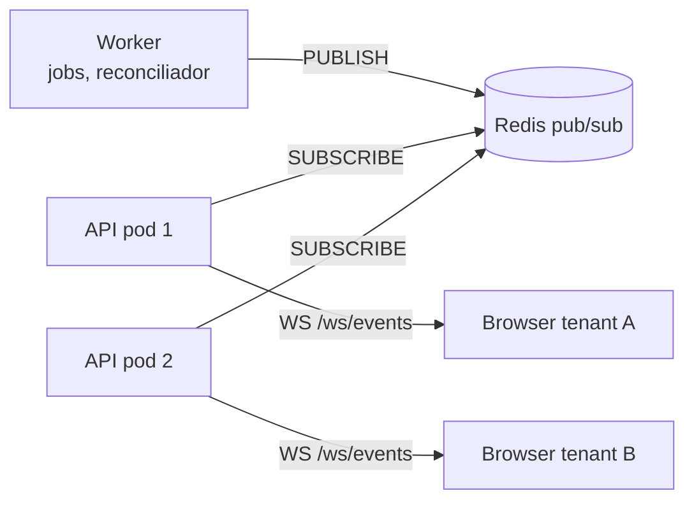
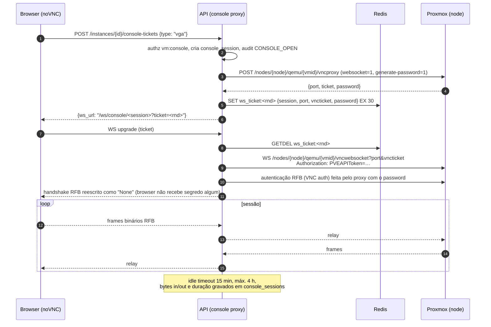
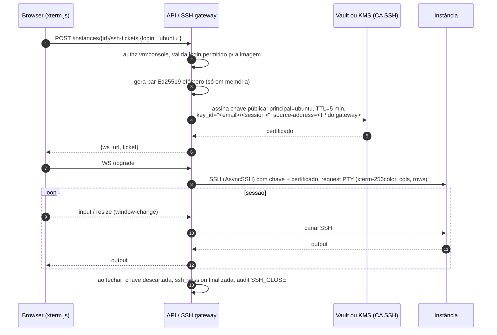

# 07 — Tempo real, console web e terminal SSH

Tudo que é tempo real usa **WebSocket** (uma tecnologia só — console e terminal exigem
WS de qualquer jeito, então eventos também vão por WS em vez de SSE).

## Autenticação de WebSocket: tickets de uso único

Browsers não enviam `Authorization` no handshake de WebSocket e colocar o JWT na URL
vaza em logs. Fluxo:

1. `POST /api/v1/…/tickets` (com Bearer) → API valida permissão e grava
   `ws_ticket:<random>` no Redis com TTL 30s contendo `{user_id, sid, tenant_id, purpose, resource_id}`.
2. Browser abre `wss://…/ws/<purpose>/<id>?ticket=<random>`.
3. No upgrade a API faz `GETDEL` (uso único), checa `Origin`, re-checa sessão e
   permissão, e só então aceita.
4. Conexões longas: a cada 60s a API checa se a sessão foi revogada; se sim, fecha com
   código `4401`.

## Canal de eventos



- Canais: `events:tenant:<id>` e `events:platform`.
- Antes de entregar, a API filtra pelo que o usuário pode ver (projeto/permissão) —
  o canal por tenant é o primeiro filtro, não o único.
- Envelope: `{"type": "job.progress", "id": "<uuid>", "ts": "…", "data": {...}}`.
  Tipos: `job.created|progress|succeeded|failed`, `instance.updated|deleted`,
  `node.status` (só admin), `quota.updated`.
- Ping a cada 25s; o cliente reconecta com backoff e refaz `GET` do que estiver na tela
  (eventos são *hint* de invalidação, não fonte de verdade).

## Console web (VGA / noVNC)



- O token do PVE e o ticket VNC **nunca** chegam ao browser.
- Terminar o handshake RFB no proxy é o objetivo da Fase 3. Se atrasar, o fallback
  aceitável é entregar ao browser só o password VNC efêmero (vale para uma porta, uma
  conexão, segundos) — documentado como risco aceito no ADR-0008.
- Atravessa nodes: o `vncwebsocket` é chamado no node onde a VM está (`provider_ref.node`
  atualizado pelo reconciliador; se migrou, a API reconsulta antes de abrir).

## Terminal de container / console serial (xterm.js)

Para LXC (e VMs com `serial0: socket`) o PVE oferece `termproxy`, que é texto, não VNC.

```
Browser (xterm.js)  ⇄  WS /ws/terminal/<session>  ⇄  API  ⇄  PVE vncwebsocket (termproxy)
   protocolo da plataforma                               protocolo termproxy do PVE
   - binário: bytes do terminal                          - 1ª msg: "<user>:<ticket>\n"
   - texto JSON: {"type":"resize","cols":..,"rows":..}  - dados: "0:<len>:<bytes>"
                 {"type":"ping"}                         - resize: "1:<cols>:<rows>:"
                                                         - ping: "2"
```

O proxy traduz entre os dois protocolos; o browser fala um protocolo único para
termproxy **e** SSH, então o componente de terminal do frontend é o mesmo.

## Terminal SSH no navegador

Decisão em [ADR-0009](../adr/0009-ssh-certificados-efemeros.md).



- A **imagem** confia na CA da plataforma: cloud-init grava
  `TrustedUserCAKeys /etc/ssh/cm_user_ca.pub` (parte do contrato de imagem).
- Nenhuma senha ou chave privada é armazenada. Se o usuário preferir senha, ela é
  digitada no próprio terminal (keyboard-interactive) e só trafega pelo canal.
- Ctrl+C, Ctrl+D, `vim`, `top` funcionam porque é um PTY real; resize via
  `window-change`.
- Host key: TOFU registrado na primeira conexão (`instances.ssh_host_keys`) e, quando
  disponível, lido do console serial/cloud-init no boot; mudança → alerta ao usuário.
- **Restrição de rede (importante):** o gateway precisa de rota até as redes dos
  tenants. Opções, por ordem de preferência: (a) gateway com interface na rede de
  gerência que roteia para as VLANs/VNets de tenant; (b) gateway como VM por zona SDN;
  (c) fallback pelo console serial (sem rede). Isso é decidido na Fase 3 com o desenho
  de rede real do seu lab.
- No MVP o gateway é um módulo da API; extrai-se para serviço próprio (`ssh-gateway`)
  quando for necessário isolar a rede ou escalar separadamente.

## Escala e limites

| Item | Limite inicial |
|---|---|
| Sessões de console/terminal por usuário | 5 |
| Sessões por instância | 3 |
| Idle timeout | 15 min (configurável por tenant) |
| Duração máxima | 4 h console / 8 h SSH |
| Pods de API | Sem sticky session: ticket no Redis, conexão vive no pod que aceitou |
